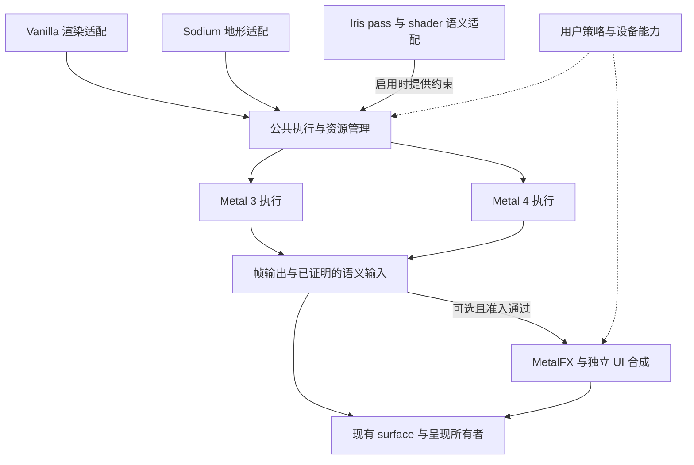

# MetalUniversal：Apple Silicon 高效率渲染实施计划

日期：2026-09-23。状态：实施中；最新执行范围与顺序见下文。

## 本次执行约定（覆盖下文的历史首批范围）

- 用户要求覆盖 P0–P5 / E1–E6 全部当前可实现工作，先完成代码、接线、测试代码和合同，再统一验证。第 13 节“首批 E1-A”不再限制本次范围。
- 隔离工作区：`/Users/retriedstormtrooper/.codex/worktrees/e1d0/MetalUniversal-stable`。
- 分支：`codex/apple-silicon-efficiency-20260923`；起始 SHA：`40b9b9bc97f005c8613683a31324d88f2501657f`（Minecraft 26.3）。保存工作区中的原计划保留。
- 阶段 A 只读取源码、SDK/API 和原始证据，批量实施并人工审查；不执行测试、编译或游戏试验。阶段 B 固定候选提交，集中验证并修复失败。
- 所有新实验默认关闭，分别验证；原生分辨率、完整画质、指定视距和 source-frame 口径保持。缺少可信功率源时不作省电结论。
- 收敛任务负责 Iris BSL alpha、26.3 terrain reference 合同和 iOS 上传修复。本任务在集中验证前同步其已完成且验证的更新，不改写共享历史。
- 逐工作包的实际调用、改变、阻塞与验证记录见 [实施记录](apple-silicon-efficiency-execution.zh-CN.md)。历史 SHA、旧分支名称、执行 Prompt 仅作出处。

本文把《MetalUniversal_Vision_and_Performance_Architecture_zh.md》和随后关于优化模组的讨论转化为实现路线。当前交付是文档；下面的阶段、接口建议和验收扩展不代表已完成的代码或性能结论。原愿景文档中的执行 Prompt 和历史分支状态作为参考材料处理。

## 1. 产品目标与首个交付

在保持 Minecraft、mod 和 shader pack 语义的前提下，以用户选择的画质、视距和目标帧率持续交付画面，减少 CPU、GPU、内存带宽和能量消耗。

首个交付目标是：**基于已有编码状态复用实现，交付一个生命周期正确、可独立开关、能够完成配对验证的 CPU 开销优化候选。** 随后推进非地形上传、编译卡顿、附件带宽和 GPU 地形工作。优先级可以因实测瓶颈调整，但每个候选要能独立判断收益。

产品要求：

- 原生分辨率、完整画质和指定视距是基础效率评估条件；基准记录真实 source frames。
- 固定目标帧率后，在正确性、帧交付和延迟约束内，把降低能耗作为直接目标。
- Vanilla 能独立工作；Sodium、Iris 通过版本化适配接入，各组合分别声明验证范围。
- Metal 3 与 Metal 4 共享语义和资源所有权，按实际设备能力选择执行路径。
- MetalFX、LOD 等可能改变图像生成方式的能力采用明确的用户选项和独立质量验收。
- 新实验默认关闭；已有开关的默认值按实际源码记录，不能把“默认开启”当成性能已验收。

## 2. 实现基线与文档边界

本次没有切换分支、运行游戏或确认远端默认分支迁移结果。源码核对使用两个可读取的固定对象：

| 对象 | 固定身份 | 用途 |
|---|---|---|
| 文档所在 checkout 的 HEAD | `cf4e66250c8fd3bcf6fdf58e00e0cd841052cd58`，`master`，Minecraft 26.2 | 阅读现有后端、上传、Iris、terrain 和验收合同；当前文档保存位置 |
| 本地已有的 26.3 收敛源码对象 | `d40b8b3ed2f7438e2dece9d5f2836bdc0a967961` | 定向核对版本、frame evidence、编码状态复用、PSO 开关与测试入口；不称其为最新远端 HEAD |

后续代码实现以分支收敛任务确定的最终 `main` 为入口，并记录实际完整 SHA。先在该 SHA 上确认下表的实现是否已被保留、替代或进一步修复，再决定补哪些代码。不要从旧 26.2 checkout 开始重做已存在的 26.3 功能。

源码路径在本文中相对仓库根目录书写。26.3 特有文件使用固定提交链接，因此即使当前 checkout 缺少该文件，也能明确查到参考对象。本文不修改依赖版本、分支生命周期规则或现有验收阈值。

## 3. 已有基础与需要继续完成的工作

“存在”只表示已检查源码或入口，不表示某个硬件、mod 组合或优化已通过实机验收。

| 工作面 | 已核对的基础 | 后续工作 |
|---|---|---|
| CPU 编码状态 | 26.3 的 [MetalRenderStatePacket](https://github.com/21Z121Z1/MetalUniversal/blob/d40b8b3ed2f7438e2dece9d5f2836bdc0a967961/src/main/java/com/metallum/client/metal/render/mtl/MetalRenderStatePacket.java) 与 [MetalRenderStateShadow](https://github.com/21Z121Z1/MetalUniversal/blob/d40b8b3ed2f7438e2dece9d5f2836bdc0a967961/src/main/java/com/metallum/client/metal/render/mtl/MetalRenderStateShadow.java) 已有 `metallum.opt.reuseEncoderState`，默认 false | 审查 reset、嵌套 encoder、失败恢复及关闭路径；补缺失行为测试，测量真实 CPU/分配与帧交付收益 |
| 上传和动态 buffer | 26.2 有 `MetalUploadDedupBuffer`、`MetalCommandEncoderUploadDedupMixin`、`MetalDynamicBackingPoolBudget` | 核对新主线中的实际接线；定位实体、粒子、文字和 HUD 的重复上传及小块分配 |
| PSO 与编译 | 26.3 的 [MetalDevice](https://github.com/21Z121Z1/MetalUniversal/blob/d40b8b3ed2f7438e2dece9d5f2836bdc0a967961/src/main/java/com/metallum/client/metal/render/MetalDevice.java) 已有 PSO archive，`asyncPrecompile` 默认 false | 校验完整 cache key、资源重载代次、后台任务关闭及首次使用路径；仅修复已定位的编译停顿 |
| 帧证据 | 26.3 有 [FrameEvidenceRecorder](https://github.com/21Z121Z1/MetalUniversal/blob/d40b8b3ed2f7438e2dece9d5f2836bdc0a967961/src/main/java/com/metallum/client/metal/render/FrameEvidenceRecorder.java)、archive/runtime、[frame-evidence-contract.md](https://github.com/21Z121Z1/MetalUniversal/blob/d40b8b3ed2f7438e2dece9d5f2836bdc0a967961/docs/agent/frame-evidence-contract.md) 和 verifier | 复用其身份、窗口与完成协议；只补所选候选需要而实际缺失的指标 |
| 附件带宽 | 26.2 有 deferred store、`IrisMetalHazardGraph`、`IrisMetalAttachmentLifetimeCompiler` 等 | 从实际资源消费者推导 store/load 与 lifetime；区分计划输出和真实 native 编码是否执行 |
| GPU 地形 | 26.2 有 `TerrainIcbOwner`、`TerrainCandidateRegistry`、`TerrainVisibleDrawPlan`、GPU visibility 和 persistent-scene 相关测试 | 核对 26.3 继承状态，验证 GPU 路径替代了哪些 CPU 工作，补跨代次与转场覆盖 |
| 调度和呈现 | 26.2 有 `TerrainSchedulingController`、`PresentationPacingSnapshot`、`MetalSurface` | 将明确的用户目标接入现有预算；核对 26.3 的 SDL/surface 所有权，再实施呈现策略 |
| MetalFX | 26.2 有 `MetalFxManager`、motion/coverage 和 frame-generation lifecycle | 在目标版本逐个 producer 证明输入与历史语义，独立验收 upscale、插帧和普通呈现 |

## 4. 架构如何落地



Iris 是附加的 shader/pass 语义适配，可以与地形 producer 组合。公共核心负责资源、命令提交和语义安全，保留 producer 的专有信息；不为绘制这张图新增一套通用 Render IR 或第二个资源身份系统。

实现中的职责分配：

| 边界 | 负责内容 | 接入位置 |
|---|---|---|
| Java renderer | producer 生命周期、draw/pass 顺序、资源代次、批次和准入条件 | `src/main/java/com/metallum/client/metal/render/`、相关 mixin |
| FFM | 参数布局、版本协商、空值、借用/保留与错误结果 | 现有 `bridge/MetalNativeBridge.java` 与协商接口 |
| Swift/Metal | native 编码、队列依赖、资源回收完成条件、能力检测 | `src/main/native/MetallumNative.swift` 及现有辅助文件 |
| Frame/terrain evidence | 复用现有 frame、submission、presentation、terrain generation 身份 | 现有 recorder、terrain oracle 与 verifier |
| 产品策略 | 用户目标、后台行为和已验收执行参数 | 扩展现有配置与调度入口；先定义小数据结构和纯决策函数 |

建议区分三个数据来源：设备能力是运行时支持事实，用户策略是显式选择，运行观测是当前负载和状态。不要用观测到的短时帧率改写能力声明，也不要按 SoC 名称硬编码一整套 renderer。

## 5. 阶段与交付顺序

| 阶段 | 可交付结果 | 开始条件 | 完成条件 |
|---|---|---|---|
| P0：建立可执行起点 | 最终主线的源码映射、一个可重放 workload、现有正确性入口与可比较帧证据 | 收敛任务给出目标 SHA | 缺失证据被精确定位；已有结果能复用；没有再建 recorder |
| P1：日常 CPU 效率 | 编码状态复用候选；随后独立推进上传与编译停顿候选 | P0 提供对应路径的基线 | 真实执行、生命周期正确、结构成本下降；性能结论有配对证据 |
| P2：用户可控的低功耗 | 前台目标帧率、后台/空闲策略、固定节奏能耗比较 | 现有帧调度所有权明确 | 策略可关闭、状态切换稳定；相同前台体验下能耗结果可解释 |
| P3：附件与带宽 | 一个完整资源生命周期内的 store/load 或复制消除 | 有相关热点且消费者已知 | 语义一致、实际 native 行为减少；带宽估算与实测分开报告 |
| P4：GPU 地形 | persistent scene、可见列表和间接绘制有效减少 CPU 工作 | producer 代次、上传发布与 fallback 正确 | 地形 oracle、实际执行与跨场景配对结果通过 |
| P5：高级显示能力 | 分别验收的 MetalFX 模式；有需要再探索 mesh shaders/LOD | 对应能力和语义输入完整 | 质量、source cadence、显示节奏和延迟分别达标 |

Sodium/Iris 兼容性回归从 P0 开始安排；各组合独立验收，不等到 P5 才处理。P2 的配置和状态机可以与 P1 并行开发，涉及提交节奏或 runtime 默认行为的改变要单独验证。

如果基线显示主要问题来自 drawable 获取、资源同步或 terrain publication，先解决该具体瓶颈，再继续表中顺序。不要为了执行路线而优化无关路径。

## 6. 工作包 E1：编码状态与非地形上传

### E1-A：闭合已有编码状态复用候选

实现顺序：

1. 在最终主线上找到 `MetalRenderStatePacket`、`MetalRenderStateShadow` 及创建/关闭它们的 encoder wrapper，确认已有修改是否完整继承。
2. 把一次借用的边界限定为一个 native encoder。重复 setter 可去重，但新 encoder 的状态必须从未知开始。
3. 区分两类存储：packet 是同步解码的 CPU scratch，可在调用返回且无引用后复用；GPU 可见 buffer、descriptor backing 和资源句柄必须遵守 GPU 完成条件。
4. 检查同线程嵌套 encoder、多个编码线程、重复 close、异常退出、部分 packet 应用失败和 legacy setter 重放。不能重复绘制，也不能跳过必要绑定。
5. 补缺失测试与执行接线；如果已有代码覆盖完整，直接进入候选验证，避免再做等价重写。
6. 复用现有 packet/shadow telemetry，记录有效窗口中的分配、复用、状态变化、FFM 次数和失败恢复。字段缺失才扩展；计数不是时间或功耗结论。

首批相关测试：`MetalRenderStatePacketTest`、`MetalRenderStateShadowTest`、`MetalComputeStateShadowTest`。重点增加能触发状态泄漏和错误恢复的行为案例，不增加仅检查源码字符串的测试。

性能假设：CPU scratch 与状态容器的重复创建是可测成本，复用会降低同等绘制工作的分配或编码时间。若配对结果没有收益，或重置成本抵销收益，保留关闭状态并结束该实验。

### E1-B：分别处理上传与 draw 合批

复用 `MetalGpuBuffer`、upload-dedup mixin 和 `MetalDynamicBackingPoolBudget`。先定位哪一种 producer 的上传量、分配或调用密度高，再选择一个干预：

- 对确实未变化的数据避免重复上传；比较数据本身的 CPU 成本必须计入。
- 合并同一合法生命周期内的小块上传，正确处理对齐、offset、stride 和 backing 代次。
- 对有 GPU 使用期的动态存储采用有界复用，提交完成前不得覆盖；内存压力下缩减闲置池。
- 只有 pipeline、资源、viewport/scissor、blend/depth 和 producer 顺序均允许时才合批；透明物和 HUD 的遮挡顺序保持原语义。

实体/粒子/文字/HUD 按独立场景验证；不要一次同时改变所有 producer。与 ImmediatelyFast 同时安装的组合要证明 mixin 和实际渲染路径兼容，避免两层批处理产生额外复制。

这种方向借鉴 ImmediatelyFast 的缓冲与提交优化；其公开旧版本 benchmark 不作为 Apple Silicon 收益预测。[ImmediatelyFast](https://modrinth.com/mod/immediatelyfast)

## 7. 工作包 E2：PSO、shader 编译与资源重载

沿 `MetalDevice`、`MetalCompiledRenderPipeline`、`MetalMslDiskCache` 和现有 native archive/编译接口实施：

1. 用已有 pipeline creation 证据确定停顿发生于源码生成、shader 编译、PSO 创建、缓存 I/O 还是线程等待；FFM wall time 不直接命名为 driver/GPU 时间。
2. 核对 key 是否包含真正影响产物的 shader 内容与 defines、entry point、vertex layout、附件格式、sample count、编译选项及必要的设备/工具链身份。
3. 从实际首次使用序列选择有限预热集合；worker 使用不可变快照，结果带资源/编译代次，重载后的旧结果不得发布。
4. 保留已验证的同步创建路径；缓存损坏或过期按可见原因重建，不能使用不匹配的旧 PSO。
5. 分开测量冷启动、首次进入场景、热缓存重入和资源重载，报告后台 CPU、启动时间及内存成本。

Metal 4 的编译接口可提供更明确的调度与 archive 工作流，具体采用取决于当前 SDK 与 wrapper 支持。[Metal 4 编译 API](https://developer.apple.com/documentation/metal/using-the-metal-4-compilation-api)

## 8. 工作包 E3：附件带宽与 Metal 执行成本

### E3-A：从消费者推导附件动作

复用 `IrisMetalHazardGraph`、`IrisMetalAttachmentLifetimeCompiler`、`MetalCommandEncoder` 和实际 native render-pass 编码。

实施链：资源读写记录 → 代次/子资源与依赖分析 → 有理由的准入决定 → 实际 attachment action → 逻辑 trace 与 native 执行验证。

- load 消除要证明初始内容不被读取，或被所需范围完整覆盖；局部 clear、scissor 和 blending 不能按全覆盖处理。
- store 消除要证明后续 pass、采样、copy、readback、history 和 present 均不需要该内容。
- memoryless 只用于当前设备支持、生命周期局限于兼容 render pass 内的附件。
- pass 合并继续尊重 RAW/WAR/WAW、显式 barrier、clear、attachment transition 和不支持的边界。
- 准入结果记录 semantic pass、generation-aware resource 和拒绝原因；不能以 shader pack 名称或 native pointer 推断安全。

先做一个已证明可消除的 store/copy，再扩展范围。每个逻辑 pass 继续保留独立语义身份。

Apple GPU 的 tile memory 提供减少外部内存流量的机会；附件字节估算和实际带宽计数需要分别标记。[Apple TBDR](https://developer.apple.com/documentation/metal/tailor-your-apps-for-apple-gpus-and-tile-based-deferred-rendering)、[资源 storage mode](https://developer.apple.com/documentation/metal/choosing-a-resource-storage-mode-for-apple-gpus)

### E3-B：按需采用 Metal 4

在现有 Metal 3/4 分流内检查 command allocator、argument table 和 encoder 创建成本。allocator 的重置以相关 GPU 工作完成为条件，argument table 的更新按实际引用期保护。能力位、ABI 版本、Java 描述符与 Swift 导出同步更新。

先沿一个热路径比较原实现与复用实现；不同时改变队列数、提交粒度和 barrier。没有对应能力时，走已验证路径并记录选择原因。[Metal 4 核心 API](https://developer.apple.com/documentation/metal/understanding-the-metal-4-core-api)

## 9. 工作包 E4：GPU 地形与 streaming

复用现有 terrain registry、storage、snapshot、ICB owner 和独立 lifecycle oracle。Nvidium 的参考价值是让 GPU 承担场景组织和可见性工作；它使用 NVIDIA 扩展且在 Iris 启用 shaders 时停用，不能直接移植其平台和兼容假设。[Nvidium](https://modrinth.com/mod/nvidium)

按四个可单独验证的步骤推进：

1. **持久场景。** 用 section/segment 的稳定身份和 generation 更新有界 GPU 数据，只发布完成上传且仍有效的代次。
2. **可见性。** 从保守的 frustum 判断开始；任何 occlusion 扩展都要覆盖相机快速转动、历史深度失效、动态遮挡和不确定 bounds。无法证明不可见时保留绘制。
3. **列表与命令。** 在正确的 compute → draw 依赖后消费 compacted list/ICB；透明排序、shadow pass 和不同视图分别保留自己的语义。
4. **替代旧路径。** 准入且提交成功后，只执行选定的绘制路径。异常恢复要区分“尚未提交”和“已部分提交”，防止 CPU fallback 造成重复绘制。

计量 CPU 场景维护/编码成本、候选与输出数量、实际 draw/ICB 执行、GPU 可见性成本和场景内存。判断净收益时包括新增 GPU 工作，不能仅报告 draw 数变少。

调度沿 `TerrainSchedulingController` 接入用户目标和上传/发布预算，先采用有界、可解释的规则。测试移动、传送、维度切换、区块反复重建和窗口状态变化；旧 generation 永不覆盖新结果。

C2ME 负责的生成/I/O/loading 并行与 Metal 的上传和渲染预算相互影响，组合测试需要保留 render thread 的运行空间。Lithium、FerriteCore 的逻辑和内存优化继续由各自项目负责。[C2ME](https://github.com/RelativityMC/C2ME-fabric)、[Lithium](https://github.com/CaffeineMC/lithium)、[FerriteCore](https://github.com/malte0811/FerriteCore)

## 10. 工作包 E5：用户策略、呈现和能耗

### E5-A：先实现小而明确的策略

建议作为现有配置的扩展，字段名称在落地时随项目规范确定：

| 配置含义 | 行为 |
|---|---|
| 前台目标帧率 | 采用用户选择的目标；记录请求值与实际生效值 |
| 后台/最小化策略 | 按用户选择降低无展示价值的渲染频率；不改变 tick、联网或模拟语义 |
| 电池策略 | 只有用户选择对应规则才改变目标；A/B 试验中固定规则 |
| 实验开关 | 每个候选独立控制，并显示能力不支持或准入失败的原因 |

用纯决策函数处理前台、后台、遮挡、恢复和显示模式变化，执行层沿现有主循环/surface 接线。恢复前台及时重建必要帧和 temporal history。与 Dynamic FPS 并存时确定唯一策略来源，避免两个 limiter 相互干扰。[Dynamic FPS](https://github.com/juliand665/Dynamic-FPS)

不预设 P/E 核绑定，不以增加全部 worker 数量作为默认优化。复杂 governor 等各个可调参数独立证明有效以后再考虑。

### E5-B：保持唯一呈现所有者

在目标版本先核对 Minecraft/SDL 与 `MetalSurface` 的线程和窗口所有权。需要 vanilla 实现细节时，使用该版本的本地 reference source。

普通路径与 MetalFX 路径必须在同一 surface epoch 内明确移交所有权；drawable 只获取和呈现一次。resize、全屏、显示器切换和窗口隐藏要使旧票据与 history 正确失效。

`CAMetalDisplayLink` 作为单独候选，仅在已有瓶颈证据与 ownership 允许时接入。目标截止时间、预计呈现时间、GPU completion 和实际 drawable callback 分开记录；低 in-flight 数量本身不证明低输入延迟。

### E5-C：扩展固定帧率下的能耗验收

当前读取的 `docs/agent/unified-evaluation-acceptance.json` 包含 FPS、CPU/GPU 时间、内存和 stutter 等指标，未将能耗列为 target metric。需要在最终主线复核后，给现有合同、比较器与测试增加版本化 profile；下列内容是待实现设计，不能当作现成命令或既有 PASS 规则。

建议新增固定节奏的产品比较模式：

- 固定 workload、原生输出分辨率、画质、视距、target cadence 和显示/电源条件。
- source FPS 继续必报；达到目标后无需通过提高 FPS 来证明该模式的能耗收益。
- 能量指标来自实际可用的测量源，附带 measurement domain、单位、采样窗口和缺项原因。CPU/GPU 域估计不改称整机能耗。
- 将功率时间序列积分得到测量窗口的能量；报告平均功率和固定体验时长的能量，避免把插帧后的帧数当作省电分母。
- 使用 A/A 了解观察者开销与噪声，事先固定有产品意义的非劣界限。沿用现有正确性和 guardrails，至少四个交错配对 block；目标改善方向与配对中位数要求继续适用。
- 没有可信的功率数据时，能耗为 `unavailable`。可以报告已证明的 CPU/分配收益，不能宣布省电。

合同、runner 和比较器对同一新 profile 同步生效之前，继续按现有验收路径报告结果。文档本身不能放宽既有阈值，也不允许以能耗改善抵销语义或帧交付回归。

## 11. 工作包 E6：MetalFX 和后续能力

沿 `MetalFxManager`、现有 motion/coverage、history 与 frame-generation lifecycle 实施，不添加影子 native 模块。

先为一个已验证 producer 接入或闭合 temporal upscaling：明确 color/depth 格式、motion 单位与方向、jitter、exposure、透明/动态几何 coverage、反遮挡和 history reset。缺少必要输入时明确停用该模式；UI 的组合顺序要保持锐利、无重复和无时序错误。

frame interpolation 单独排期，增加 source pair 身份、生成帧准入、source age 与实际呈现验证。shader pack 切换、传送、分辨率变化和窗口恢复都要有序列测试。

| 能力 | 进入实现的条件 |
|---|---|
| MetalFX temporal / 新硬件加速变体 | 当前 SDK/API 可用、descriptor 的设备支持检查通过、producer 输入完整，且质量与功耗收益可验证 |
| Mesh shaders | 已有 GPU 地形路径显示剩余几何组织瓶颈；设备支持且存在可维持语义的回退路径 |
| LOD / Voxy 适配 | 独立的远景产品选项与质量合同；不记为同等原生几何的效率收益 |
| Metal I/O、稀疏资源、光线追踪 | 有具体 workload 与可替代工作，单独提出范围明确的实验 |

Apple API 和 feature tables 是能力参考，不能推导所有 Apple Silicon 具有相同实现或收益。[MetalFX](https://developer.apple.com/documentation/MetalFX)、[Metal 最新能力](https://developer.apple.com/metal/whats-new/)、[Metal Feature Set Tables](https://developer.apple.com/metal/Metal-Feature-Set-Tables.pdf)、[Voxy](https://modrinth.com/mod/voxy)

## 12. 验证矩阵与证据

### 场景和设备

| 场景 | 主要覆盖 |
|---|---|
| 静止与缓慢转动 | 编码固定成本、呈现节奏、持续功耗 |
| 实体/方块实体/粒子密集 | 非地形上传、draw 顺序和可见性 |
| HUD、文字和 GUI | scissor、alpha、资源重载与高频小绘制 |
| 高速移动和大视距 | 区块 build/upload/publication、GPU scene 更新 |
| 传送、维度切换与资源重载 | 代次、回收、PSO、motion/history 失效 |
| resize、前后台、全屏和显示切换 | surface epoch、策略恢复和唯一呈现所有者 |

P0 就登记实际可用的低内存/无风扇设备与高性能设备。性能/内存下限和 API 能力下限是不同维度；未测设备不标记为实机已验证，支持范围结合能力条件和代表性矩阵单独声明。每个 producer 组合绑定实际版本与 shader pack 身份，依赖可解析不等于兼容性通过。

### 三种验证互不代替

1. **工程验证：** 生命周期和错误路径测试、Java/FFM/Swift ABI 一致性、相关 native 编码测试、完整接线和实际 activation。
2. **正确性验证：** 现有 render contract、generation oracle、Metal validation 和场景序列；用第一个分歧 pass/resource 定位失败。
3. **产品验证：** 低开销的配对实机运行、真实 source/presentation 数据与持续能耗。conformance 的重 readback 和完整 producer trace 不混入性能窗口。

`ResourceIdentity` 与 semantic pass 身份继续负责语义关联，frame evidence 的 frame/submission/presentation 身份负责时序关联；使用显式映射连接，不能凭时间接近猜测。

source FPS 的计数点必须对应完成的有效 source frame，并以同一测量窗口的经过时间为分母；递归 loading-screen scope 要明确区分，不能用 `renderFrame` 的 CPU 执行耗时倒数充当 FPS。呈现间隔只从有效、去重且属于测量窗口的实际回执计算；窗口不完整时披露覆盖缺口。

GPU 各 submission 的时长不能无条件相加为一帧关键路径；FFM 的 inclusive wall time 不与其内部 drawable wait 重复相加；实际呈现回执缺失不记为零延迟，也不把 render-to-present 时间称为完整输入延迟。先等待客户端正常退出及既有 drain/export 完成，再验证最终证据包。

每个候选至少报告：源码/JAR/native 身份、有效窗口、开关和 activation、source FPS、呈现间隔/长帧、CPU/GPU 成本、内存、目标结构成本与可用能耗。readback、编码命令数、实际呈现与物理显示结果分别说明边界。

### 现有执行入口

以下供后续代码任务使用，本次文档编写不运行 GPU 或游戏测试。入口必须在最终主线上重新确认。

```bash
# 环境与现有 harness 自检。
bash scripts/agent/doctor.sh
bash scripts/agent/verify_unified_eval.sh

# 涉及通用 render contract 时的合成检查。
./gradlew --no-daemon renderContractSyntheticValidation

# 26.3 已有 frame evidence verifier 的自检。
python3 scripts/agent/verify_frame_evidence.py --self-test
```

26.3 Vanilla 的真实客户端/打包入口按固定提交的 [frame-evidence-contract.md](https://github.com/21Z121Z1/MetalUniversal/blob/d40b8b3ed2f7438e2dece9d5f2836bdc0a967961/docs/agent/frame-evidence-contract.md) 及最终主线后继执行；使用可丢弃的世界副本。frame evidence 的完整性通过不等于图像正确性或性能通过。

现有 unified runner 的已定义 profiles 面向 Iris 优化，不假设它已接受 Vanilla 编码复用或能耗 profile。新增候选要先接入 profile、admission、报告窗口和比较器，再运行该候选的 correctness/ABBA 路径。`CANDIDATE_PROFILE` 不能填写一个尚未注册的名称来宣称完成。

纯 JVM 检查、macOS native/GPU 检查和真实客户端分别选择对应任务；不使用无范围的 `./gradlew build` 充当 headless smoke test。

## 13. 首批任务拆分与完成定义

第一批围绕 E1-A 编码状态复用闭环，不同时引入地形算法、MetalFX 或呈现调度重写。

| 任务 | 负责范围 | 依赖 | 可审查产物 |
|---|---|---|---|
| T1：对接最终主线 | 对应源码与测试的保留/替代映射；版本和运行入口 | 收敛任务的最终 SHA | 一份简短差异记录；已完成能力不重新实现 |
| T2：完成复用候选 | packet/shadow、调用者生命周期与针对性测试 | T1 | 缺陷修复或确认已有实现完整；开关、错误恢复和测试证据 |
| T3：接入候选验证 | 复用现有 frame/packet 指标及候选 profile；只补实际缺项 | T1；与 T2 协调字段 | 可执行的 activation、窗口和配对入口；不会把不完整 trial 判成功 |
| T4：实机判定 | 正确性、单候选交错配对与低端设备覆盖 | T2、T3 | accepted / rejected / inconclusive 的证据与后续动作 |

需要多人执行时，T2 和 T3 按上述文件职责划分，最终集成者负责 ABI、profile、测试和默认值一致；同一物理 GPU 的性能试验串行进行。

每个工作包完成时回答：

- 原来实际执行的哪项工作被减少或替代了？新增成本是多少？
- 哪个真实调用路径启用了它，哪些组合仍未验证？
- 生命周期、失败恢复和兼容性由哪些行为测试与实机证据支撑？
- 哪些指标改善、退化或仍 unavailable？是否满足既有及本次预先定义的验收条件？
- 默认值是否具备充分依据，回退路径是否经过验证？

代码和针对性验证完成但缺少物理设备时，可以交付明确的工程成果；产品性能与省电结论保持未验收，并留下精确命令、身份和缺失条件。拒绝的候选按仓库规则回退；噪声或覆盖不足的候选不默认开启。

## 14. 参考材料的使用方式

原愿景文档提供产品约束和研究背景；本计划提供实现拆分。现有 [统一评估流程](agent/unified-evaluation-loop.md)、[验收配置](agent/unified-evaluation-acceptance.json) 和 [render contract](render-contract-validation.md) 继续负责当前可执行验收。历史文档与源码不一致时，核对目标 SHA 的实现和执行证据，并修正相关文档。

外部项目提供优化思路：[Sodium](https://github.com/CaffeineMC/sodium) 的渲染与兼容生态、[ImmediatelyFast](https://modrinth.com/mod/immediatelyfast) 的提交/缓冲优化、[Nvidium](https://modrinth.com/mod/nvidium) 的 GPU 地形、[EntityCulling](https://github.com/tr7zw/EntityCulling) 的可见性消除，以及前文的 CPU、内存和功耗项目。参考这些职责与算法动机，不能把它们在其他平台、版本或画质下的性能数字转化为 MetalUniversal 的预期收益。
