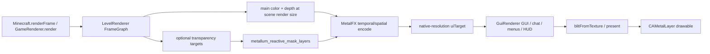

# MetalUniversal 渲染管线取证摘要

> **2026-07-26 live-source correction**
>
> 本文正文是实现前的取证快照，不再代表当前工作树的实现状态。当前源码已经具有 indexed 1/2/3/8-slot MRT、普通实体 object motion/validity producer、camera/object merge、previous-depth disocclusion、offscreen MetalFX Temporal/Frame Interpolator GPU readback、自动 Minecraft client capture，以及基于真实 `CAMetalDisplayLink` drawable 的自动 presenter timeline test。仓库现已在 `MetalUniversal-master` 初始化 Git，但尚无 baseline commit。Frame Generation gate 仍因对象类别覆盖不完整而保持关闭。当前结论和验收证据以 `docs/metalfx-motion-pipeline-implementation.md`、`docs/metalfx-frame-generation.md` 和 `docs/metalfx-final-acceptance-2026-07-26.md` 为准。

状态：证据固化版；覆盖范围已形成，但不宣称所有结论 100% 闭合。本文只记录当前工作树、Minecraft 26.2 映射源码、Sodium 0.9 反编译源码、运行日志和已经存在的单元测试能够支持的结论。没有在实现目录写入补丁。`confirmed` 只表示代码/日志/交叉证据支持该事实，不表示 GPU driver 行为或视觉结果已经验证。

## 基线

| 项目 | 当前值 | 证据与限制 |
| --- | --- | --- |
| 工作目录 | `/Users/retriedstormtrooper/Documents/Projects/Active/MinecraftMetal/MetalUniversal-master` | 当前 shell 工作目录 |
| Git | 不是有效 Git 仓库；branch/HEAD 无法确定 | `git status --short --branch` 返回 `fatal: not a git repository`；因此不能声称工作树相对某个提交未变化 |
| macOS / 硬件 | macOS 26.5.1；MacBookPro18,3；Apple M1 Pro；16 GB | 当前环境命令输出；硬件信息没有 GPU capture 佐证 |
| Xcode / Swift | Xcode 26.6；Swift 6.3.3 | 当前环境命令输出 |
| Java / Gradle | Java 24；Gradle 9.4.1 | `/Users/retriedstormtrooper/Documents/Projects/Active/MinecraftMetal/MetalUniversal-master/gradle.properties:37` 要求 Java >=25；Java 24 执行 `--release 25` 时阻塞 Java 编译 |
| Minecraft / Fabric / Sodium | Minecraft 26.2；Fabric Loader 0.19.3；Sodium `mc26.2-0.9.0-fabric` | `/Users/retriedstormtrooper/Documents/Projects/Active/MinecraftMetal/MetalUniversal-master/gradle.properties:10-13` |
| Loom | 属性写成 `1.16-SNAPSHOT`，本地解析记录为 1.16.3 | 属性与解析结果不一致，详见 `14-inconsistencies.md` |
| MetalUniversal | mod version 1.0.1；mod id `metallum` | `/Users/retriedstormtrooper/Documents/Projects/Active/MinecraftMetal/MetalUniversal-master/gradle.properties:15-17`、`src/main/resources/fabric.mod.json:3-5` |
| Mapped sources | 可读：`/tmp/minecraftmetal-mc26-sources` | 当前本地文件存在；未联网下载 |
| Sodium sources | 可读：`/tmp/minecraftmetal-sodium-decomp` | 当前本地反编译目录存在；没有把反编译结果当成 Mojang 原始源 |

## 当前真实 frame graph

当前代码形成的是“低分辨率世界场景 -> MetalFX 输出到原生分辨率 UI target -> GUI 合成 -> present”的结构。`LevelRenderer.render` 的 FrameGraph 先把 `GameRenderer.mainRenderTarget()` 作为 `main` 导入，并在启用 shader transparency 时建立 `translucent`、`item_entity`、`particles`、`weather`、`clouds` 等目标（Minecraft 26.2 映射：`/tmp/minecraftmetal-mc26-sources/net/minecraft/client/renderer/LevelRenderer.java:163-260,365-510`；目标集合：`/tmp/minecraftmetal-mc26-sources/net/minecraft/client/renderer/LevelTargetBundle.java:12-90`）。`MetalFxManager.beforeGuiInternal` 在 GUI 之前把这个场景 target 编码到 `uiTarget` 或 Frame Generation 的 `sceneOutputTarget`（当前代码：`/Users/retriedstormtrooper/Documents/Projects/Active/MinecraftMetal/MetalUniversal-master/src/main/java/com/metallum/client/metal/render/MetalFxManager.java:393-516`）。之后 `GuiRenderer.draw` 被 redirect 到原生分辨率 `uiTarget`（`GuiRendererMetalFxMixin.java:12-22`），最后由 `MinecraftMetalFxMixin` 和 `MetalSurface` 走 drawable present（`MinecraftMetalFxMixin.java:29-45`；`MetalSurface.java:62-68`）。

**置信度：confirmed。** 交叉证据是 Java target redirect 与 Swift/Metal encoder 的 present bridge；限制是没有本轮 GPU capture，因而 pass 的实际 GPU 时间和 driver 内部别名关系未知。

## Temporal 成熟度

当前 Temporal 路径不是空 wrapper：Java manager 有真实低分辨率 color/depth、V2 motion 资源、jitter、history reset 和 `encodeMetalFxV2` 接入。mode 选择要求 MetalFX Temporal support 与 `metallum_metalfx_supports_motion_v2` 同时为真（`MetalFxManager.java:249-257`）；资源创建和对象输入清零位于 `MetalFxManager.java:642-700`，Java V2 调用位于 `MetalFxManager.java:456-479`，native V2 export 和 camera/merge compute 位于 `MetallumNative.swift:1355-1508,1844-2011`。

V2 的当前实际数据流是：camera kernel 从 depth 和 current/previous camera 矩阵写 `cameraMotionTexture`/`disocclusionTexture`；`objectMotionTexture` 与 `objectValidityTexture` 在世界绘制前被清零，当前生产代码没有 renderer 对它们写入；merge 因此选 camera motion，并把 disocclusion/depth edge 合并进 reactive。`MetalMotionStateStore.observe`、`MetalMotionContract.projectVertex` 只有定义/测试调用，没有生产 producer（`MetalMotionStateStore.java:31-44`；`MetalFxManager.java:53,301,547`；`rg` 未发现 `observe` 的生产调用）。所以动态实体、Sodium 区块顶点动画、粒子运动和 alpha-cutout 风动仍没有真实对象 motion。

**总体判断：strong_inference。** V2 resource/compute/bridge topology 由源代码和当前 macOS/iOS bundled dylib 的 `nm -gU` 符号交叉确认；对象 producer 缺失由负向调用搜索确认；画质、抖动和拖影仍需真机视觉验证。

## Motion 覆盖范围

| 内容 | 当前 motion 证据 | 判断 |
| --- | --- | --- |
| 静止几何 + 相机平移/旋转 | native `metallum_motion_reconstruction` 使用 inverse current jittered VP、current/previous unjittered VP；Java mirror 单测覆盖静止、平移、旋转 | confirmed for runtime formula; visual result still needs capture |
| 普通实体、玩家、持有物、方块实体 | 未见上一帧对象矩阵写入 object motion attachment；V2 merge 只有 validity 非零才选择对象 motion | confirmed absence in inspected path; complete entity audit deferred |
| 粒子、雨雪、云 | 颜色分别可进入 transparency target，但 object validity 没有 producer，最终 motion 仍是相机重建 | confirmed for inspected bridge |
| alpha-cutout 树叶/草 | 与主 `main` 颜色/深度一起渲染；不在五个直接 transparency target 中，只有 depth-edge heuristic 间接覆盖 | confirmed path, artifact cause still needs visual proof |

## GUI 是否真正分离

**结构上是，语义上有边界。** `GameRendererMetalFxMixin.beforeGui` 在 `GuiRenderer.render` 前执行 MetalFX；`GuiRendererMetalFxMixin.draw` 将 GUI 的 `mainRenderTarget()` redirect 为 native-resolution `MetalFxManager.guiTarget`（`GameRendererMetalFxMixin.java:78-84`、`GuiRendererMetalFxMixin.java:12-22`）。因此 HUD、聊天、菜单和正常 GUI 不进入 Temporal history。第一人称手、屏幕效果、feature rendering、3D crosshair 位于 `GameRenderer.renderLevel` 内，属于场景侧而不是 GUI 侧（`GameRenderer.java:547` 及 `LevelRenderer.render` 调用链）。

**置信度：confirmed for code ordering；限制：没有逐个 GUI 层的 GPU capture。**

## 透明内容当前处理

直接 reactive 来源是 `translucent`、`itemEntity`、`particles`、`weather`、`clouds` 五个目标，注入点为 `LevelRenderer.addAlwaysOnTopPass` HEAD（`LevelRendererMetalFxMixin.java:17-25`；`MetalFxManager.java:518-566`）。native `metallum_metalfx_mark_transparency` 使用近二值 alpha/color 检查，再叠加 3x3 depth validity/gradient heuristic（`MetallumNative.swift:1098-1126,1175-1209,1211-1265,1346-1398`）。这不是对象运动 mask，也不是连续材质分类；alpha-cutout 和实体 motion 仍缺真实输入。

## Frame Generation 当前结构

Frame Generation 的 native presenter 结构存在，但当前 Java gate 明确关闭：`OBJECT_MOTION_PRODUCER_CONNECTED=false`（`MetalFxManager.java:29-33`），而 `frameGenerationEnabled` 还要求该常量为真（`MetalFxManager.java:99-116`）。因此当前工作树的实际 present 不会进入 `frameGenerationInputInternal`；`MetalFxManager.java:790-822` 和 `MetallumNative.swift:65-221,2013-2095` 是 dormant/conditional path。该 path 若以后被打开，Java 提供 pre-GUI scene color、post-GUI composed UI color、scene depth、merged motion、jitter、FOV、near/far、aspect 和 reset；native 复制到三个 private slots，由 `MetalFX PresentThread` worker 消费，并由 `readyEvent` 连接输入 command buffer 与 present queue。`maxOutstandingFrames` 实际为 1；`frameDuration` 在 presenter 创建时按 `NSScreen.maximumFramesPerSecond` 采样，缺省 60、下限 30，真实帧用 `afterMinimumDuration(frameDuration * 0.5)`（`MetallumNative.swift:89-94,165-174,724`）。没有运行时 display timing/VRR 回调，最终扫描时序仍需真机验证。

## 最危险的五个问题

1. **动态内容没有对象 motion producer（confirmed absence in inspected bridge）。** V2 object motion/validity attachment 会被清零，`MetalMotionStateStore` 也没有生产观察调用；叶片风动、实体、粒子只能依赖相机 motion 和 reactive/depth heuristic。
2. **尺寸契约有运行时反证（confirmed runtime artifact）。** 历史 crash 记录 GUI scissor `1708x524` 被应用到 `1144x642` render area；说明至少某条 GUI/scissor 路径仍混用 display/render 尺寸。报告不能把当前代码中的尺寸函数当成已解决证明。
3. **当前内置 pipeline 没有 motion MRT contract，但通用 Metal backend 本身已支持 indexed 多附件（confirmed with boundary）。** `RenderPipeline`/`RenderPass` 支持最多 8 个 color slots，Java encoder、`MetalRenderPass`、`MetalCompiledRenderPipeline` 和 Swift v2 bridge 都逐槽传递；当前 Minecraft 26.2 与 Sodium 0.9 已枚举 pipeline 仍只声明 slot 0（`RenderPipeline.java:147-159,241-255`；`RenderPass.java:82-98`；`MetalCommandEncoder.java:134-180,205-227`；`MetalCompiledRenderPipeline.java:114-125,187-216`；`MetallumNative.swift:2484-2580,3214-3275`；`RenderPipelines.java` 43 个无 index 调用；`ShaderChunkRenderer.java:51-66`）。增加 motion MRT 的缺口在 pipeline/shader/FrameGraph contract 和 Temporal input 接线，而不是“native 只能绑定一个附件”。
4. **Frame Generation 当前被常量 gate 关闭，pacing 只存在于 dormant presenter（confirmed source; runtime behavior unknown）。** `OBJECT_MOTION_PRODUCER_CONNECTED=false` 使当前 Java 不进入 FG；若后续打开，pacing 只在 presenter 创建时采样屏幕刷新率，没有 VRR/presentation timestamp 回调。
5. **没有 Git 基线且 native build 输出位于 tracked resource 路径（confirmed risk）。** build task 输出 `src/main/resources/natives/{macos,ios}/libmetallum.dylib`（`build.gradle:53-74,109-132`），本次历史构建可能重写二进制；由于仓库没有 Git，无法可靠判定前后差异。

## 证据最强的五个结论

1. **真实低分辨率场景存在。** `sceneWidthInternal/sceneHeightInternal` 选择 scaled target（`MetalFxManager.java:263-270`），历史日志记录 Temporal `input=1144x642, output=1708x960`；交叉证据是 `ensureTargets` 与 `beforeGuiInternal`（`MetalFxManager.java:578-630,393-516`）。
2. **GUI 在 MetalFX 后合成。** 注入点和 target redirect 均在当前代码中明确（`GameRendererMetalFxMixin.java:78-84`、`GuiRendererMetalFxMixin.java:12-22`）。
3. **motion 约定是 previous-screen minus current-screen。** native MSL/Java mirror 和日志明确打印该 convention，数学实现为 `previousClip - currentClip`（`MetallumNative.swift:1211-1264`；`MetalFxMath.java:120-157`；`latest.log:111`）；单测覆盖方向（`MetalFxMathTest.java:57-93`）。
4. **reactive mask 的直接输入只有五类透明目标。** Java 取五个 `LevelTargetBundle` handles，native 处理 binary alpha/color 加 depth heuristic（`MetalFxManager.java:518-566`、`MetallumNative.swift:1098-1126,1175-1209,1211-1265,1346-1398`）。
5. **Frame Generation 的 dormant contract 使用 pre-GUI scene 与 post-GUI composed UI 两份颜色。** Java 的 `frameGenerationInputInternal` 与 native slot/export 结构交叉支持该条件路径，但当前 gate 为 false（`MetalFxManager.java:790-822`；`MetallumNative.swift:81-87,2013-2095`）。

## 仍未知或需要运行验证

- Minecraft 窗口在所有 resize、Retina scale、全屏和 GUI scissor 状态下的真实 pixel/viewport 值。
- MetalFX driver 对 motion 纹理的实际采样、depth sampling、jitter 最终画面响应和 reactive strength 的运行时表现；motion 的方向/像素 scale 已由本地 Xcode 26.5 SDK 契约与 native producer 交叉确认，但仍没有 GPU capture。
- Sodium 之外的模组 shader、实体局部动画和第三方 renderer 是否绕过当前 backend。
- 当前进程实际加载的 native dylib、`SymbolLookup` 返回的 V2 symbols，以及当前运行到底选择 Temporal/Spatial；bundled macOS/iOS 文件的 `nm -gU` 结果已确认 V2 symbols 存在，但没有 runtime loader trace。
- 每个 runtime `RenderPipeline` 的完整枚举和真实 shader key 集合。
- Frame Generation 在刷新率改变、VRR、窗口隐藏、应用后台和 drawable timeout 下的实际行为；`maximumFramesPerSecond` 只在 presenter 初始化采样。
- 本轮 `buildMacNative`/`buildIOSNative` 生成的 dylib 与构建前二进制是否字节不同；无 Git 基线不能作 diff 结论。

## Sol 优先级

1. 先确认当前进程加载的 native dylib、V2 capability 和实际 `effectiveMode`，再复现 display/render/GUI viewport 契约和 Temporal jitter/motion 的真机 capture。
2. 在不改功能的前提下枚举 runtime pipeline，确认 cutout、entity、particle 和 Sodium terrain 的 object attachment/validity 是否始终为空。
3. 再决定树叶/实体的 reactive、velocity replay 或 MRT 边界；当前最小事实边界是 `MetalFxManager` V2 resource preparation、`MetalMotionStateStore`、`MetalCommandEncoder.encodeMetalFxV2`、`MetalCompiledRenderPipeline` 和 native `metallum_metalfx_encode_v2`。
4. 只有在 object producer 接通且 FG gate 明确后，才验证 Frame Generation pacing 与 drawable timing，先测 `maximumFramesPerSecond`、`afterMinimumDuration`、VRR 和 drawable 时间戳。
5. 最后才处理 Sodium UI/config 和兼容性；它们不是当前 motion 根因的直接证据。

## 首轮报告索引

本轮已固化全部要求文件：`01-module-map.md`、`02-frame-cpu-timeline.md`、`03-frame-graph.md`、`04-resolution-and-coordinate-systems.md`、`05-matrices-jitter-motion-conventions.md`、`06-shader-and-pipeline-compilation.md`、`07-metalfx-current-implementation.md`、`08-dynamic-content-and-transparency.md`、`09-known-artifacts-root-cause-map.md`、`10-frame-generation-and-presentation.md`、`11-lifecycle-synchronization-resource-safety.md`、`12-mixin-and-version-coupling.md`、`13-sol-adaptation-map.md`、`14-inconsistencies.md`、`sol-handoff.json`。
