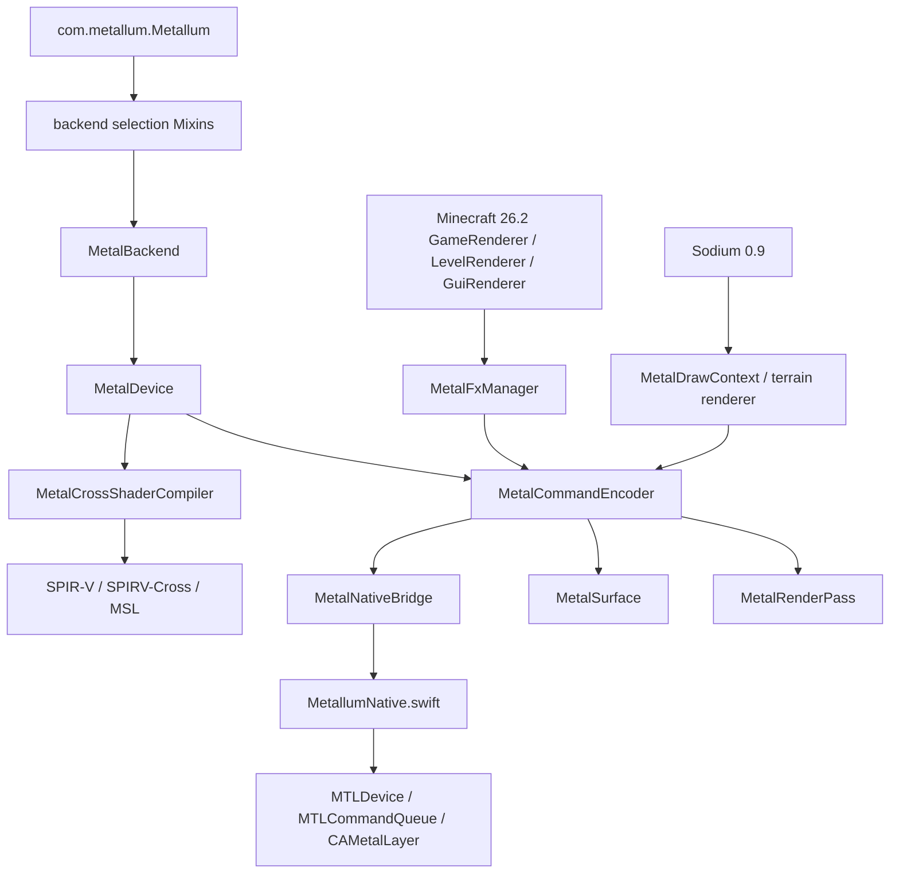

# 模块地图与所有权边界

> **2026-07-26 status:** 本文是实现前模块快照。新增 MRT、entity motion、validation 和 presenter 模块及当前所有权合同见 `../metalfx-motion-pipeline-implementation.md`、`../metalfx-frame-generation.md` 和最终验收报告。

本文范围是当前工作树中实际参与渲染、MetalFX、Sodium 接入和 native present 的模块。路径均相对于当前项目的绝对路径列出。

## 依赖图

**交叉证据：** Fabric entrypoint/mixin 声明（`/Users/retriedstormtrooper/Documents/Projects/Active/MinecraftMetal/MetalUniversal-master/src/main/resources/fabric.mod.json:20-32`、`metallum.mixins.json:8-17`）、Java backend 类声明、native C exports（`MetallumNative.swift:1529-1567,1569-1615,1676-2011,2919-2990`）。**限制：** 图表示调用/所有权关系，不表示 GPU driver 内部 command queue 调度。

## Java 层模块

| 模块 | 当前职责 | 证据 | 所有权边界 |
| --- | --- | --- | --- |
| Mod 入口 | pre-launch 加载 native/SPIRV-Cross，Fabric 初始化 | `/Users/retriedstormtrooper/Documents/Projects/Active/MinecraftMetal/MetalUniversal-master/src/main/java/com/metallum/Metallum.java:10-35` | Java/Fabric 生命周期；不拥有 Minecraft render target |
| Mixin config plugin | 根据 target/client 条件筛选 mixin | `/Users/retriedstormtrooper/Documents/Projects/Active/MinecraftMetal/MetalUniversal-master/src/main/java/com/metallum/mixin/MetallumMixinConfigPlugin.java:15-50` | Mixin 应用决策，不拥有 GPU 资源 |
| Graphics API 选择 | vanilla/Minecraft backend 与 Sodium backend redirect | `src/main/java/com/metallum/mixin/render/PreferredGraphicsApiMixin.java:14-32`；`src/main/java/com/metallum/mixin/sodium/DrawBackendMixin.java:10-17` | 只改变选择/工厂入口 |
| `MetalBackend` | 创建 `MetalDevice`、`MetalSurface`、资源/encoder backend | `src/main/java/com/metallum/client/metal/render/MetalBackend.java:20` 及其 create 方法 | Java 对 native handles 的包装；设备级资源由 `MetalDevice` 持有 |
| `MetalDevice` | native device handle、shader cache、compiled pipeline cache、command encoder 创建 | `src/main/java/com/metallum/client/metal/render/MetalDevice.java:32,42-43,155-168,261-287` | 设备级 cache 和 close；不决定 Minecraft pass 顺序 |
| `MetalCommandEncoder` | render/blit encoder、indexed color attachment array、submit semaphore、present bridge | `src/main/java/com/metallum/client/metal/render/MetalCommandEncoder.java:28-33,104-123,134-180,205-227,243-287,676-704` | 负责 Java command submission；native command object 在 Swift；当前已枚举 pipeline 通常只有 slot 0 |
| `MetalRenderPass` | color/depth attachment array、viewport/scissor、draw state | `src/main/java/com/metallum/client/metal/render/MetalRenderPass.java:33-80,382-409,476-548` | pass wrapper；不拥有整个 FrameGraph；可保留 null color slot |
| `MetalCompiledRenderPipeline` | 将 Minecraft `RenderPipeline` 的 shader/bind/blend/depth/color-target 数组转为 native PSO | `src/main/java/com/metallum/client/metal/render/MetalCompiledRenderPipeline.java:23,114-125,187-216` | 逐 pipeline cache entry；PSO attachment setup 已按 index，当前内置 pipeline 仍是单 target |
| `MetalCrossShaderCompiler` | GLSL -> SPIR-V module/reflection -> MSL -> native function | `src/main/java/com/metallum/client/metal/render/MetalCrossShaderCompiler.java:34-38,65-99,344-405` | 编译器/绑定重映射；不创建 render pass |
| texture/view/buffer/sampler | `MetalGpuTexture`、`MetalGpuTextureView`、`MetalGpuBuffer`、`MetalGpuSampler` 负责资源句柄和关闭 | `src/main/java/com/metallum/client/metal/render/MetalGpuTexture.java:17`；同目录各类声明 | 每个 Java wrapper 负责对应 native handle；GPU 完成前释放依赖 destruction queue/submit fence |
| `MetalSurface` | `CAMetalLayer` 句柄、drawable acquire、blit/present、submit | `src/main/java/com/metallum/client/metal/render/MetalSurface.java:19,62-68` | surface 级 layer/pending encoder；drawable 是 layer 提供 |
| `MetalFxManager` | MetalFX mode、scaled target、jitter、history、motion/reactive texture、GUI target、Frame Generation 输入 | `src/main/java/com/metallum/client/metal/render/MetalFxManager.java:24-778` | Java-side frame state；native scaler/interpolator 由 Swift cache/slots 持有 |
| Config/Sodium Config API | system property 和持久化 MetalFX settings；Sodium config page options | `src/main/java/com/metallum/client/metal/render/MetalFxConfig.java:18-31,87-123,244-295`；`MetalFxSodiumConfig.java:13-119` | 配置读写；不直接创建 GPU resource |

## Swift/Metal 层模块

| 模块 | 当前职责 | 证据 | 所有权 |
| --- | --- | --- | --- |
| Native global state | native device/queue、pipeline/scaler cache、frame-generation slot 状态 | `/Users/retriedstormtrooper/Documents/Projects/Active/MinecraftMetal/MetalUniversal-master/src/main/native/MetallumNative.swift:60-145` | Swift process/global state；Java 只持有 opaque handles |
| MetalFX encode | `MTLFXSpatialScaler`/`MTLFXTemporalScaler` descriptor、V2 camera/object merge、资源绑定和 encode | `MetallumNative.swift:1676-2011` | cache 在 native；输入 texture handle 来自 Java |
| transparency/motion compute | `metallum_metalfx_mark_transparency`、V2 camera/merge/clear kernels；legacy camera kernel保留 | `MetallumNative.swift:1098-1126,1175-1508,1559-1615` | native private auxiliary textures/pipelines；object attachments当前由Java clear |
| Frame Interpolator | 三 slot scene/composed/depth/motion/interpolation，一个 `MetalFX PresentThread` worker、一个 `readyEvent` | `MetallumNative.swift:65-221,375-762,2013-2095` | native worker 线程和 slots；当前 Java object-producer gate关闭 |
| Present copy/pipeline | fullscreen copy/flip 到 drawable；通用 render-pass v2 保留 indexed color slots，fullscreen present 自身使用 slot 0 | `MetallumNative.swift:871-1070,2484-2580,2972-3002` | native command buffer/encoder；drawable 由 layer 提供 |

## Minecraft 26.2 与 Sodium 边界

Minecraft 26.2 的 `GameRenderer` 拥有 `mainRenderTarget`（`/tmp/minecraftmetal-mc26-sources/net/minecraft/client/renderer/GameRenderer.java:105,165,317-320,689-690`）；`LevelRenderer` 拥有 FrameGraph target bundle（`LevelRenderer.java:163-260`；`LevelTargetBundle.java:12-90`）；`GuiRenderer` 在 `net/minecraft/client/gui/render/GuiRenderer.java` 中执行 GUI draw（`GuiRenderer.java:120,180-217`）。这些资源的创建和 pass 顺序属于 Minecraft，MetalUniversal 通过 Mixin redirect/HEAD injection 改变 target 或在 pass graph 中追加 reactive pass。

Sodium 的 `DrawBackendMixin.chooseBackend` 选择 `VK_INDIRECT`，`DrawContextMixin.create` 返回 `MetalDrawContext`；`ChunkSectionsToRenderMixin.renderGroup` 取消 vanilla group rendering 并调用 Sodium `drawChunkLayer`（`/tmp/minecraftmetal-sodium-decomp/net/caffeinemc/mods/sodium/mixin/core/render/world/ChunkSectionsToRenderMixin.java:28-47`、`src/main/java/com/metallum/mixin/sodium/DrawBackendMixin.java:10-17`、`DrawContextMixin.java:11-18`）。Sodium terrain renderer 仍通过通用 `RenderPass`/Metal backend；其当前 `ShaderChunkRenderer` 只声明一个 color target，但 backend 的 indexed attachment 能力并非单附件硬限制。

## native build 输出边界

`buildMacNative` 将 Swift 输出写到 `src/main/resources/natives/macos/libmetallum.dylib`，`buildIOSNative` 写到 `src/main/resources/natives/ios/libmetallum.dylib`（`/Users/retriedstormtrooper/Documents/Projects/Active/MinecraftMetal/MetalUniversal-master/build.gradle:53-74,109-132`）。这意味着构建是有可能改变资源目录二进制的；当前没有 Git baseline，不能给出前后字节差异。
