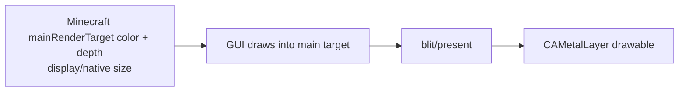
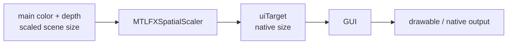
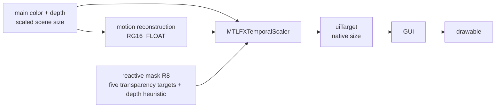
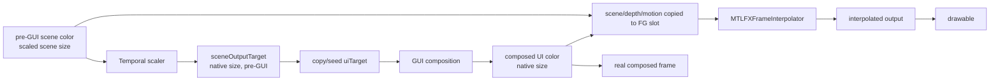

# 当前真实 Frame Graph 与资源节点

> **2026-07-26 status:** 本文是实现前 frame-graph 快照。当前 graph 已增加 indexed MRT、object validity、preserved world depth、merged motion、disocclusion 和自动 GPU capture；请以 `../metalfx-motion-pipeline-implementation.md` 为准。

## FrameGraph 来源

Minecraft 26.2 `LevelRenderer.render` 在 `/tmp/minecraftmetal-mc26-sources/net/minecraft/client/renderer/LevelRenderer.java:163-260` 创建 `FrameGraphBuilder`，导入 `main`，按配置建立 transparency targets，随后执行 sky/main/outline/cloud/weather/transparency/always-on-top 等 passes（同文件 `:365-510`）。`LevelTargetBundle` 定义主要 handles（`/tmp/minecraftmetal-mc26-sources/net/minecraft/client/renderer/LevelTargetBundle.java:12-90`）。MetalUniversal 在 `LevelRendererMetalFxMixin` HEAD 注入 `metallum_reactive_mask_layers`（`/Users/retriedstormtrooper/Documents/Projects/Active/MinecraftMetal/MetalUniversal-master/src/main/java/com/metallum/mixin/render/LevelRendererMetalFxMixin.java:17-25`）。

## OFF

OFF 时 `MetalFxManager.sceneWidthInternal/sceneHeightInternal` 返回输入尺寸（`MetalFxManager.java:263-270`），不创建 MetalFX auxiliary textures；普通 Minecraft main target 和 GUI target 相同。**置信度：confirmed by mode branches；限制：没有当前 OFF GPU capture。**

## SPATIAL

`beforeGuiInternal` 先以 scaled main target 为 input，调用 `MetalCommandEncoder.encodeMetalFx` 的 spatial 分支，输出 `uiTarget`，然后 GUI 继续在 `uiTarget` 绘制（`MetalFxManager.java:393-516`；native `metallum_metalfx_encode` spatial/temporal dispatch `MetallumNative.swift:1414-1579`）。

## TEMPORAL

Temporal branch 的实际 guard 是 V2 资源全部存在且 `motionInputsPrepared` 为真（`MetalFxManager.java:456-479`）；`ensureAuxiliaryTextures` 创建 camera/object/validity/disocclusion/final-motion/reactive 六类资源，尺寸均为 scene render size（`MetalFxManager.java:642-684`）。`prepareMotionInputs` 在世界绘制前只清零 object motion/validity（`MetalFxManager.java:687-700`）；没有当前 renderer producer 写回它们。

## TEMPORAL + FRAME GENERATION

`beforeGuiInternal` 先选 `sceneOutputTarget`，成功后把 pre-composited scene copy/seed 到 `uiTarget`（`MetalFxManager.java:448-505`）。但当前 `OBJECT_MOTION_PRODUCER_CONNECTED=false`，所以该 FG graph 是条件路径；`frameGenerationInputInternal` 只有 gate 打开才会提供 scene/depth/merged-motion/UI（`MetalFxManager.java:790-822`），native presenter 结构在 `MetallumNative.swift:65-221,2013-2095`。**置信度：Temporal V2 texture roles=confirmed；FG ordering=confirmed conditional topology，当前实际 activation/runtime slot timing 未验证。**

## 资源节点清单

| 节点 | 创建位置/所有者 | 尺寸/格式/storage/usage | 写入/读取 pass | 生命周期/resize/release | 当前证据判断 |
| --- | --- | --- | --- | --- | --- |
| drawable | `MetalSurface` + native `CAMetalLayer`（`MetalSurface.java:19,62-68`；`MetallumNative.swift:2919-2990`）/ native layer | layer drawable pixel size；实际 pixel format 由 layer/format bridge，代码路径未在首轮固定成单一常量 | final copy/present | layer acquire 每次 present；系统拥有 drawable；不要由 Java close | confirmed existence; exact runtime format unknown |
| main scene color | Minecraft `GameRenderer.mainRenderTarget`（`GameRenderer.java:105,165,689-690`）/ Minecraft target | `RGBA8_UNORM` + scaled dimensions in active MetalFX mode；Metal backend resource usage includes render target | sky/main/features/transparency composite; read by MetalFX | Minecraft target resize；manager redirects construction/resize through `GameRendererMetalFxMixin.java:16-77` | confirmed low-resolution active path; exact aliasing unknown |
| main scene depth | same `RenderTarget` / Minecraft + Metal backend | `D32_FLOAT`; clear 0.0; reversed depth contract | all scene depth writes; read by motion reconstruction and Temporal | resized with main target; depth validity after post/GUI must be checked at runtime | confirmed format/clear contract from code/log |
| `translucent` | `LevelTargetBundle` / Minecraft FrameGraph | RGBA8+D32 when shader transparency enabled; scene size | translucent pass; reactive mask read | FrameGraph/resource allocator lifetime per render graph; no MetalFx close call | confirmed conditional node |
| `item_entity` | `LevelTargetBundle` / Minecraft | RGBA8+D32 scene size | item entity transparency; reactive read | conditional FrameGraph | confirmed conditional node |
| `particles` | `LevelTargetBundle` / Minecraft | RGBA8+D32 scene size | particles; reactive read | conditional FrameGraph | confirmed conditional node |
| `weather` | `LevelTargetBundle` / Minecraft | RGBA8+D32 scene size | weather; reactive read | conditional FrameGraph | confirmed conditional node |
| `clouds` | `LevelTargetBundle` / Minecraft | RGBA8+D32 scene size | clouds; reactive read | conditional FrameGraph | confirmed conditional node |
| entity outline | imported/created by `LevelRenderer` | target bundle format; not a Temporal motion input | outline chain | Minecraft FrameGraph | confirmed node, exact active use depends config |
| post-process intermediates | Minecraft `PostChain`/resource pool | no dedicated MetalFX-owned node proven | `GameRenderer.render` post effect before `beforeGui` | resource pool lifecycle; no independent MetalFx release evidence | unknown as a separate node |
| `cameraMotionTexture` | `MetalFxManager.ensureAuxiliaryTextures` / native V2 camera kernel | scene render size, `RG16_FLOAT`, texture binding + shader-write | `metallum_motion_camera_v2`; read by V2 merge | rebuilt with auxiliary set; closed by `closeAuxiliaryTextures` (`MetalFxManager.java:642-684,758-773`) | confirmed producer; camera-only |
| `objectMotionTexture` | `MetalFxManager.ensureAuxiliaryTextures` / clear pass | scene render size, `RG16_FLOAT`, texture binding + shader-write + render attachment | clear before world; intended renderer MRT producer; V2 merge read | rebuilt/cleared/closed with auxiliary set | confirmed allocation and clear; no current producer |
| `objectValidityTexture` | same | scene render size, `R8_UNORM`, texture binding + shader-write + render attachment | clear before world; intended validity MRT; V2 merge read | same | confirmed allocation and clear; current value remains invalid/zero by inspected path |
| `disocclusionTexture` | `ensureAuxiliaryTextures` / native V2 camera kernel | scene render size, `R8_UNORM`, texture binding + shader-write | `metallum_motion_camera_v2`; V2 merge/reactive | same | confirmed camera/disocclusion producer; visual rejection unknown |
| `motionTexture` | `ensureAuxiliaryTextures` / native V2 merge kernel | scene render size, `RG16_FLOAT`, texture binding + shader-write | `metallum_motion_merge_v2`; read by Temporal/conditional FG | recreated when dimensions/mode require; closed by `closeAuxiliaryTextures` | confirmed non-placeholder allocation; current output is camera motion because object validity has no producer |
| `reactiveTexture` | same | scene render size, `R8_UNORM`, texture binding + shader-write | direct transparency mask + V2 camera/merge; read by Temporal | same auxiliary lifecycle | confirmed allocation; direct mask plus depth/disocclusion, not full material/object mask |
| `uiTarget` | `MetalFxManager.ensureTargets` | native display size, `RGBA8_UNORM`; render target | MetalFX output, then GUI | rebuilt in `ensureTargets` when dimensions change; `TextureTarget.destroyBuffers`/`MetalGpuTexture.close` release | confirmed GUI target separation |
| `sceneOutputTarget` | `ensureTargets` only when FG enabled | native display size, scene output color; format follows RGBA8 target | Temporal output before GUI; read/copy by FG | only FG; rebuilt on resize; close path `closeInternal` | confirmed role; exact native target format should be runtime logged |
| FG previous/current scene color | native `FrameInterpolator` slot set | native size/private; copied from Java inputs | interpolator | three private slots, slot reuse after events; native shutdown drains | confirmed native ownership |
| FG previous/current depth | native slot set | scene/render resolution depth copied into slot; exact interpolator resource format from descriptor path | interpolator | slot lifetime | confirmed input role; exact slot format requires capture/source segment |
| FG motion | native slot set | scene/render resolution motion; same Java motion contract | interpolator | slot lifetime | confirmed input role; unit conversion beyond Java log not proven |
| interpolated output | native slot | native size/private RGBA output | FrameInterpolator output -> drawable copy | slot reuse after ready/pacing events | confirmed |
| present intermediate | native fullscreen copy/present pipeline | drawable/private color; color attachment 0 only | copy/flip to drawable | transient command buffer resource | confirmed; no separate Java texture node |

## 明确的“存在/不存在”结论

- **低分辨率真实发生：confirmed。** `sceneWidthInternal` 改变 main target 尺寸，历史日志显示 `1144x642 -> 1708x960`；不是先全分辨率再缩小的唯一路径。
- **独立 opaque/cutout 颜色 target：未确认存在。** Sodium SOLID/CUTOUT 共享 main/terrain target，FrameGraph 只额外列出 transparency targets。
- **GUI 排除 Temporal history：代码结构上 confirmed。** GUI 在 `beforeGuiInternal` 后执行。
- **reactive mask 不是空 placeholder：confirmed。** 有真实 `R8_UNORM` allocation 和 native compute；但覆盖范围有限。
- **FG 颜色输入：confirmed conditional pre-GUI scene + post-GUI composed UI。** 当前 `OBJECT_MOTION_PRODUCER_CONNECTED=false`，不应把该 dormant graph 描述成当前每帧实际 present。
- **对象 motion：confirmed scaffold, not connected producer。** object motion/validity 有资源和 clear pass，但当前没有 Minecraft/Sodium draw pass 写入，V2 merge 因此退回 camera motion。

## load/store 与释放限制

Minecraft/native 通用 render pass v2 按数组逐槽设置 clear/load/store，保留空槽；fullscreen copy/present pass 自身仍只需要 slot 0（`MetallumNative.swift:2484-2580,2805-2829,2954-2990`；`MetalCommandEncoder.java:134-180`）。具体每个 Minecraft FrameGraph pass 的 load/store 由映射源码 descriptor/lambda 决定，当前首轮没有逐 pass 复制，不能推断所有 pass 都是 clear，也不能据此声称当前 frame graph 已使用第二颜色槽。资源 close 也受 Minecraft FrameGraph allocator、Java destruction queue、native in-flight slots 三方影响；必须在后续生命周期章节继续核对。
