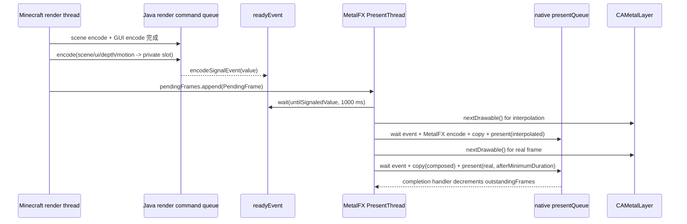

# Frame Generation 与 present 调度

> **2026-07-26 live-source correction**
>
> 本文正文描述的是旧 presenter，不能用于当前验收。固定 120 Hz、`31/64` 延迟、present thread 自行 `nextDrawable()` 和 targeted-present 模型均已移除。当前 display-link update 独占其系统 drawable，保存 deadline 与 presentation timestamp，使用普通 `commandBuffer.present(drawable)`，并由显式 source-frame 状态机处理 drop/failure/shutdown。真实可见窗口的自动 timeline 验证已通过；生产 gate 因对象覆盖不足仍关闭。当前合同见 `../metalfx-frame-generation.md`。

## 结论边界

当前源码可以确认 Java render thread、Swift `MetalFX PresentThread`、两条 Metal command queue、`MTLSharedEvent`、三槽 private texture set、首帧/失败/resize/shutdown 的条件控制流。但当前 `MetalFxManager.OBJECT_MOTION_PRODUCER_CONNECTED=false`，所以 Java 不会把 `frameGenerationInputInternal` 的输入交给该 presenter；当前实际 present 仍走普通 drawable path。源码不能证明实际显示器扫描时序、VRR 行为、drawable 的真实 presentation timestamp、输入延迟或最终插值画面质量。下面把源码事实与运行时未知分开。

证据交叉点：Java 的最终 surface 调用 `MetalSurface.blitFromTexture` -> `MetalCommandEncoder.presentTextureToDrawable`（`src/main/java/com/metallum/client/metal/render/MetalSurface.java:57-68`），Minecraft 的调用者是 mapped `Minecraft.renderFrame` 末尾的 `windowSurface.blitFromTexture`（`/tmp/minecraftmetal-mc26-sources/net/minecraft/client/Minecraft.java:1226-1310`）。

## Java 输入边界

`MetalFxManager.frameGenerationInputInternal` 只有在 `frameGenerationEnabled`、非 `runtimeDisabled`、当前帧已使用 upscaled target、`sceneOutputTarget`/`uiTarget`/`frameDepthTexture`/`motionTexture` 均存在且传入的 presented texture 正是 `uiTarget` color texture 时才返回输入（`src/main/java/com/metallum/client/metal/render/MetalFxManager.java:790-822`）。但 `frameGenerationEnabled` 的初始化还受 `OBJECT_MOTION_PRODUCER_CONNECTED=false` gate（`MetalFxManager.java:29-33,99-116`），所以以下是 dormant contract。它返回：

```text
sceneColor   = pre-GUI, display/native-resolution sceneOutputTarget
uiColor      = GUI draw 完成后的 uiTarget color texture
depth        = 本帧 mainRenderTarget depth
motion       = 本帧 render-resolution motionTexture
inputWidth/Height = renderWidth/renderHeight
jitter/FOV/near/far/aspect/reset = 本帧 Java 标量状态
```

这里有一个需要交给后续实现模型的尺寸边界：Java bridge 参数里的 `inputWidth/inputHeight` 来自 `renderWidth/renderHeight`，但 native `MetalFrameGenerationPresenter.encode` 不把这两个 export 参数传入 `PendingFrame`；`PendingFrame.inputWidth/inputHeight` 实际从 `depth.width/height` 写入（`MetallumNative.swift:1582-1663,528-547`）。`makeFrameInterpolator` 也以 depth 尺寸作为 input、以 sceneColor 尺寸作为 output（`:201-218`），motion scale 使用该 native frame input 尺寸的一半（`:667-679`）。因此当前设计预期 `Java renderWidth/Height == main depth/motion texture dimensions`；源码没有对 Java scalar 与 depth texture dimensions 做跨层相等断言，export scalar 主要用于日志。**confidence：native source path=confirmed；当前运行时尺寸相等=needs runtime log/capture。**

在 `beforeGuiInternal`，Temporal/Spatial 输出首先写入 `sceneOutputTarget`（FG 开启时）或 `uiTarget`；FG 开启时再把该 scene output copy 到 `uiTarget`，随后 GUI 在 `uiTarget` 上绘制（`MetalFxManager.java:421-475`）。因此 FG 的 scene color 是 pre-GUI，ui color 是 post-GUI；两者不是同一张 history texture。

`MetalCommandEncoder.presentTextureToDrawable` 在最终提交前调用上述输入函数；若 dormant gate 未来打开且 native encode 成功，才会调用 `metallum_metalfx_frame_generation_encode`，否则回到普通 `encodePresentTextureToDrawable`（`MetalCommandEncoder.java:349-389`；bridge 包装在 `MetalNativeBridge.java:1001-1050`；Swift export 在 `MetallumNative.swift:2013-2095`）。

**置信度：confirmed control flow。限制：尚未用 GPU capture 验证最终 drawable 的实际纹理内容和 present timestamp。**

## Native 状态和资源所有权

`MetalFrameGenerationPresenter` 建立一条独立的 `presentQueue` 和一个 `readyEvent`，保存一个 `MTLFXFrameInterpolator`、copy pipeline/sampler，并启动名为 `MetalFX PresentThread` 的 worker（`MetallumNative.swift:65-221`）。没有名为 `Frame Pacing` 的独立线程，也没有第二个 pacing shared event。该结构在当前 Java gate 下是 dormant。

每个 `TextureSet` 有五类 private texture：`scene`、`composed`、`depth`、`motion`、`interpolation`；`bufferCount=3`，但 `maxOutstandingFrames=1`。一个输入帧会消费一个插值 drawable 和一个真实帧 drawable，所以该条件路径主动限制同时在途的 source frame 为一个（`MetallumNative.swift:81-109`）。纹理的 color usage 是 `.shaderRead | .shaderWrite | .renderTarget`，depth 是 `.shaderRead | .renderTarget`，motion 是 `.shaderRead | .shaderWrite | .renderTarget`，storage mode 是 `.private`（`MetallumNative.swift:224-308`）。

| 资源/状态 | producer | consumer | 同步/释放 | 证据等级 |
| --- | --- | --- | --- | --- |
| `sceneBuffers[index]` | Java Temporal/Spatial scene output copy | `frameInterpolator.colorTexture`/`prevColorTexture` | 输入 command buffer 完成并 signal `readyEvent` 后 worker 使用；resize/shutdown 前 drain | confirmed topology；GPU completion timing 未 capture |
| `composedBuffers[index]` | Java GUI-composed `uiTarget` copy | `frameInterpolator.uiTexture` 和真实帧 copy | 同上 | confirmed |
| `depthBuffers[index]` | Java main depth copy | `frameInterpolator.depthTexture` | 同上 | confirmed |
| `motionBuffers[index]` | Java motion texture copy | `frameInterpolator.motionTexture` | 同上 | confirmed |
| `interpolationOutputs[index]` | `MTLFXFrameInterpolator.encode` | fullscreen copy 到 interpolation drawable | 同一 `presentQueue` command buffer | confirmed |
| `readyEvent` | Java/input command buffer `encodeSignalEvent` | present command buffer wait + CPU `wait(untilSignaledValue:)` | 一秒 CPU timeout；失败时显式推进 event | confirmed |
| `pendingFrames` | render thread `encode` append | PresentThread `removeFirst` | `NSCondition` | confirmed |
| `lastEncodedIndex/timestamp` | accepted interpolation command commit 后更新 | 下一次 `process` 选 previous color / delta time | reset/resize 清空 | confirmed |

**重要限制：** `metallum_metalfx_frame_generation_encode` 接收 `globalFence`，但 `MetalFrameGenerationPresenter.encode` 首行 `_ = globalFence`（`MetallumNative.swift:419-434`）。当前 FG 的输入依赖是同一 input command buffer 的 blit + shared event，而不是该 fence。不要把 bridge 参数存在描述成 native 已使用 fence。

## 一帧的 GPU/线程时间线



`encode` 在 render thread 上把四张输入纹理 copy 到 slot，并 signal `readyEvent`，然后把 `PendingFrame` 放入条件变量队列（`MetallumNative.swift:419-553`）。worker 取出后等待 event；等待失败或输入 command buffer 失败时直接 `completeFrame()`，不会继续调用 `presentRealFrame`（`:623-635`、`:555-577`）。这是“丢弃整个 source frame”路径，不只是跳过插值。

`process` 先选 `previousIndex = lastEncodedIndex ?? frame.index`，并以 `frame.reset || lastEncodedIndex == nil` 决定 interpolator reset。首帧因此 current/previous color 是同一 slot 且 reset 为 true。成功编码并 commit 插值 command buffer 后才更新 `lastEncodedIndex` 和 `lastEncodedTimestamp`，随后调用 `presentRealFrame`（`MetallumNative.swift:637-697`）。

插值器实际绑定：当前 scene color、上一 accepted scene color、当前 depth、当前 motion、当前 composed UI；`isUITextureComposited=true`，jitter/FOV/near/far/aspect/deltaTime/depthReversed/reset 逐字段设置（`:657-681`）。UI 没有单独的 previous UI slot；`prevColorTexture` 是 scene history。

真实帧在同一个 native `presentQueue` 上排在插值 command buffer 后面，源为 `composedBuffers[index]`，`present` 使用 `afterMinimumDuration: frameDuration * 0.5`（`:699-728`）。源码顺序足以确认“插值 present command 先提交、真实 present command 后提交”；不能仅凭源码证明 WindowServer 最终扫描顺序在所有 GPU/显示器条件下都严格保持该间隔。

## 时间参数与刷新率

`frameDuration` 不是固定 120 Hz。presenter 初始化时从 layer delegate 的 window screen 或 `NSScreen.main` 读取 `maximumFramesPerSecond`，下限 30、缺失时默认 60，再计算 `1.0 / refreshRate`（`MetallumNative.swift:149-170`）。它只在 presenter 创建时采样；源码没有更新屏幕切换、VRR 状态或显示器刷新率变化的回调。

`PendingFrame.timestamp` 在 render thread enqueue 时用 `CACurrentMediaTime()` 记录（`:468-474`）。`process` 使用上一 accepted interpolation timestamp 计算 `deltaTime`，并 clamp 到 `[1/240, 0.25]`；reset/首帧/非有限或非正 delta 使用 `frameDuration`（`:637-648`）。所以：

- 真实 frame 间隔由 `afterMinimumDuration(frameDuration * 0.5)` 约束，不是 CPU sleep；
- 插值器 delta time 主要来自 enqueue timestamp，不是 drawable presentation timestamp；
- VRR、显示器实际刷新、WindowServer queue latency 和 scanout 没有源码证据；
- presenter 创建后刷新率改变不会自动更新 `frameDuration`。

**置信度：前两项和采样逻辑 confirmed；非 30/60/120 Hz 的最终行为为 strong_inference risk，VRR 行为 unknown。**

## drop、resize、GUI、shutdown

- `layer.maximumDrawableCount=3`、`allowsNextDrawableTimeout=true`。`nextDrawable()` 返回 nil 时，插值阶段会退化到 `presentRealFrame`；真实阶段拿不到 drawable/command buffer 时只 `completeFrame`，没有进一步 CPU fallback（`MetallumNative.swift:166-170,650-703`）。实际 timeout 长度未知。
- 输入 command buffer error 会把 event value 直接推进到失败值并登记 `failedInputEvents`，worker 随后丢弃该 frame，避免一秒等待卡住（`:555-577`）。
- source 尺寸、格式或 layer pixel format 改变时，`encode` 调 `resizeResources`；该函数先 `drain()`，再创建 texture set、新 interpolator 和 copy pipeline，最后清空 `nextBufferIndex`、`lastEncodedIndex`、`lastEncodedTimestamp`（`:443-457,375-417`）。
- `drain` 等待 `outstandingFrames==0`；`shutdown` 设置 `stopping`、唤醒 worker，并等待 `workerExited` 与 `outstandingFrames==0`，之后 native stop 函数把 presenter 置空，下一次 encode 懒创建（`:738-762`；export `MetallumNative.swift:1715-1742`）。
- 若后续打开 FG gate，GUI screen/overlay active 时，Java `frameGenerationInputInternal` 会调 `suspendFrameGenerationForGuiInternal`；它停止 native presenter 但保留 `sceneOutputTarget`，最终走普通单 present。GUI 消失后的下一帧重新开启 FG 并 reset Temporal history（`MetalFxManager.java:289-301,790-842`）。当前 gate 为 false，因此这段 pause/resume 逻辑未被当前 Java 配置实际触发。

## 当前不能静态确认的事项

1. `readyEvent` signal、private slot copy、interpolator read 和 Java target release 的 GPU 完成顺序在真实设备上的时间戳。
2. `CAMetalLayer.nextDrawable` timeout 的具体行为，以及 hidden/minimized/occluded window 下是否每次都及时返回 nil。
3. `afterMinimumDuration` 在 FIFO/Mailbox、不同刷新率和 VRR 屏幕上的最终呈现顺序。
4. 插值器读取 current depth/motion 是否与当前 scene color 的同一帧 exactly 对齐；代码拓扑一致，但无 GPU capture。
5. worker shutdown 与 Java `MetalCommandEncoder.close`/surface teardown 交错时是否存在设备特定 race。源码有 drain，但没有端到端 close trace。

**Sol 的最小验证：**记录 source enqueue timestamp、ready event value、input/present command buffer completion、两个 drawable 的 acquired/presented timestamp、实际 screen refresh/VRR 状态和 resize epoch；至少覆盖 60/120 Hz、VRR、hidden、resize、GUI open/close 和首帧。
